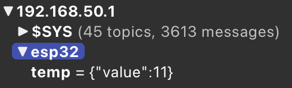

# Rapport de Projet IoT : ESP32CAM via MQTT

**Auteurs :**  
- **BOUVIER Joris**  
- **EL BELGHITI Ismail**  
- **MEHIELDINE Hachem**

---

## Introduction

Ce projet s'inscrit dans le cadre du cours d'IoT de la formation IESE à Polytech Grenoble en 2024. Son objectif principal est de permettre une prise en main des technologies suivantes :  
- **ESP32-CAM** pour la capture d'images.  
- **Protocole MQTT** pour la transmission des données.  
- **Node-RED** pour le traitement et l'affichage des données via un tableau de bord web.  
- **InfluxDB** pour le stockage des images.  
- **Grafana** pour la visualisation des données.  

Le projet vise à exploiter ces outils pour construire une solution complète de capture, transmission, stockage et affichage d'images.

---

## Objectifs

Les objectifs du projet sont les suivants :  
1. Manipuler l’ESP32-CAM pour capturer des images.  
2. Transmettre les images via MQTT en les encodant en Base64.  
3. Créer des nœuds Node-RED pour :  
   - Récupérer les images envoyées par MQTT.  
   - Décoder et afficher les images.  
   - Ajouter des contrôles pour la prise de photos et l'activation du flash.  
4. Stocker les images dans une base de données InfluxDB.  
5. Visualiser les images stockées dans InfluxDB via un tableau de bord Grafana.  

---

## Matériel Utilisé

- **ESP32-CAM** : module pour la capture d'images.  
- **Raspberry Pi 3** : utilisé pour exécuter les services suivants sur un réseau WiFi local (créé avec RaspAP) :  
  - **Mosquitto** : broker MQTT.  
  - **Node-RED** : environnement pour créer des flux de données.  
  - **InfluxDB** : base de données.  
  - **Grafana** : plateforme de visualisation de données.  

---

## Réalisation

### 1. Installation des Outils

Les outils nécessaires ont été installés et configurés sur un Raspberry Pi 3 :  
- **RaspAP** pour établir un réseau WiFi local.  
- **Mosquitto** pour le broker MQTT.  
- **Node-RED** pour le traitement des données.
- **InfluxDB** pour le stockage des données.
- **Grafana** pour la visualisation des données.

Les étapes détaillées d'installation sont documentées sur [GitHub](https://github.com/jorisbouvier/ESP32_Camera_Public/tree/main/RaspberryPi).

---

### 2. Prise en Main des Outils

#### **ESP32-CAM**  
L'ESP32-CAM a été configurée à l'aide d’un code de base permettant de capturer des images via une interface web. [Code source](https://github.com/jorisbouvier/ESP32_Camera_Public/tree/main/ESP32%20Camera/Snippets/CameraWebServer).  

Sur cette interface, il est possible d'observer le flux vidéo en direct, de prendre des photos, et d'activer le flash, de mettre en place une reconnaissance faciale, etc.

#### **Protocole MQTT**  
Un premier test du protocole MQTT a été réalisé en transmettant des données simulées (valeurs de température aléatoires) depuis l’ESP32-CAM. [Code Arduino utilisé](https://github.com/jorisbouvier/ESP32_Camera_Public/tree/main/ESP32%20Camera/Snippets/ESPMQTT).  
Nous avons ensuite utilisé MQTT explorer pour visualiser les messages envoyés.

#### **Node-RED**  
Un premier flux Node-RED a été créé pour traiter les données de température envoyées via MQTT par l’ESP32-CAM.

Sur cette image, on peut voir le flux de traitement des données de température envoyées par l’ESP32-CAM, les données sont visibles dans le debug (à droite).
De plus on test aussi l'envoi de messages MQTT à l'ESP32-CAM, ici on envoie sur le topic "esp32/Node_red" un horodatage lorsque l'on clique sur le bouton inject.

#### **InfluxDB et Grafana**  
Grace à l'ajoût d'un noeud InfluxDB dans Node-RED, nous avons pu stocker les données de température dans une base de données InfluxDB.

Les données envoyées par l’ESP32-CAM ont été stockées dans InfluxDB et affichées sur un tableau de bord Grafana.  

---

### 3. Transmission et Décodage d'Images

#### **Transmission des Images**  
Un code Arduino a été développé pour capturer une image avec l’ESP32-CAM, l’encoder en Base64, et l’envoyer via MQTT.  
[Code disponible ici](https://github.com/jorisbouvier/ESP32_Camera_Public/tree/main/ESP32%20Camera/ESPMQTTCam).  

#### **Décodage et Affichage**  
Un flux Node-RED a été conçu pour décoder les images reçues en Base64 et les afficher sur un tableau de bord interactif (Node-RED Dashboard). Nous avons aussi ajouté des contrôles pour la prise de photos et l'activation du flash.

  
  

---

### 4. Stockage et Visualisation des Images

Les images décodées ont été stockées dans une base de données InfluxDB via Node-RED, puis affichées dans un tableau de bord Grafana.  

  

Maintenant, nous pouvons visualiser les images prises par l'ESP32-CAM sur le tableau de bord Grafana et grace à InfluxDB nous avons un historique des images prises.

---

## Analyses

### Domaines d’Application
- **Surveillance** : gestion à distance de caméras.  
- **Sécurité** : contrôle d’accès et monitoring.  
- **Domotique** : gestion de dispositifs connectés.  
- **Santé** : suivi à distance des patients.  
- **Industrie** : supervision des machines.  

### Avantages
- Facilité d’utilisation et d’intégration.  
- Modularité et extensibilité du système.  
- Coût relativement faible.  

### Limites
- Résolution limitée des images de l’ESP32-CAM.  

### Améliorations Potentielles
- Amélioration de la qualité des images. 
    - Utilisation d’une caméra externe.
    - Compression des images.
- Intégration de nouvelles fonctionnalités comme :  
  - Détection de mouvement.  
  - Reconnaissance faciale ou d’objets.  

### Fiche ACV

| Critère | Valeur |
| --- | --- |
| Durée de vie | 5 ans |
| Durée d'utilisation | 24h/jour |
| Consommation électrique | 5W |
| Coût de fabrication | 10€ |
| Coût de maintenance | 10€/an |
| Coût de recyclage | 5€ |
| Coût de fin de vie | 5€ |
| Impact environnemental | Faible |
| Impact social | Faible |
| Impact économique | Faible |

### Fiche Security & Privacy

| Critère | Valeur |
| --- | --- |
| Confidentialité | Moyen |
| Intégrité | Moyen |
| Disponibilité | Moyen |
| Authentification | Moyen |
| Autorisation | Moyen |
| Non-répudiation | Moyen |
| Sécurité des données | Moyen |
| Sécurité des communications | Moyen |
| Sécurité des systèmes | Moyen |
| Sécurité physique | Moyen |
---

## Conclusion

Ce projet a permis de maîtriser des technologies variées et de construire une solution fonctionnelle de capture, transmission, stockage et affichage d’images. Bien qu’il s’agisse d’un projet d’introduction, les outils et méthodes explorés offrent des perspectives intéressantes pour des applications plus complexes.  