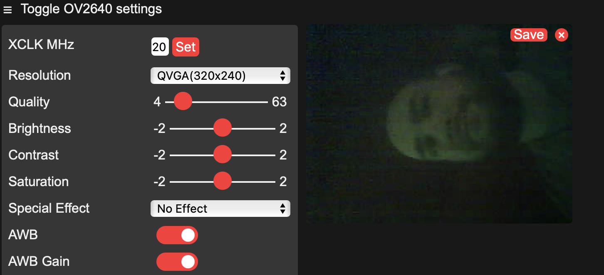
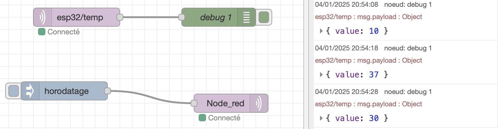
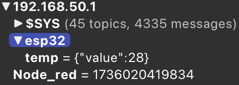
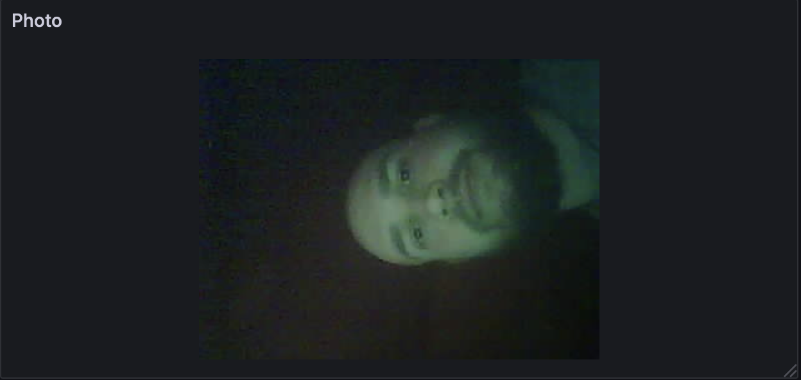

# Rapport de projet

# Projet ESP32CAM via MQTT

**Auteurs :**
- BOUVIER Joris
- EL BELGHITI Ismail
- MEHIELDINE Hachem

## Introduction

Ce projet a été réalisé dans le cadre du cours d'IOT de la formation IESE de Polytech Grenoble, en 2024. 
Ce projet vise simplement en prendre en main des outils tel que l'ESP32 caméra, le protocole MQTT, la création de noeuds sur Node-RED, et la création d'une interface web sur Node-RED Dashboard. De plus, nous avons utilisé une base de données InfluxDB pour stocker les images prises par la caméra et nous avons utilisé Grafana pour afficher ces images.

## Objectifs

Les objectifs de ce projet sont les suivants :
- Prendre en main l'ESP32 caméra
- Envoyer des images prises par l'ESP32 caméra via le protocole MQTT en convertissant les images en base64
- Créer un noeud sur Node-RED pour récupérer les images envoyées par l'ESP32 caméra et décoder les images en base64
- Créer une interface web sur Node-RED Dashboard pour afficher les images (utilisé juste pour le test)
- Stocker les images dans une base de données InfluxDB depuis Node-RED
- Afficher les images stockées dans InfluxDB sur Grafana

## Matériel utilisé

- ESP32 caméra : ESP32-CAM
- Raspberry Pi 3 : pour executer Mosquitto, Node-RED, InfluxDB et Grafana, le tout sur un reseau WiFi local (RaspAP)

## Réalisation

### Installation des outils

Dans un premier temps, il est nécessaire de configurer le Raspberry Pi 3 pour qu'il puisse faire office de broker MQTT, de serveur Node-RED, de base de données InfluxDB et de serveur Grafana, le tout sur un réseau WiFi local.
- RaspAP : pour créer un réseau WiFi local
- Mosquitto : pour le broker MQTT
- Node-RED : pour la création de noeuds
- InfluxDB : pour la base de données
- Grafana : pour l'affichage des données

On peut retrouver le processus d'installation de ces outils [ici](https://github.com/jorisbouvier/ESP32_Camera_Public/tree/main/RaspberryPi).
Une fois les outils installés, on peut passer à la prise en main de ces outils.

### Prise en main

Dans cette partie, nous allons voir comment nous avons pris en main les outils suivants :
- ESP32 caméra
- MQTT
- Node-RED
- InfluxDB
- Grafana

Nous allons voir comment nous avons pris en main ces outils et comment nous les avons utilisés pour réaliser ce projet.

#### ESP32 caméra

Pour prendre en main l'ESP32 caméra, nous avons utilisé le code fourni par le constructeur de l'ESP32 caméra. Ce code permet d'accéder à la caméra et de prendre des photos depuis une page web, on peut le trouver [ici](https://github.com/jorisbouvier/ESP32_Camera_Public/tree/main/ESP32%20Camera/Snippets/CameraWebServer).

Une fois le code téléversé sur l'ESP32 caméra, nous avons pu accéder à la page web de l'ESP32 caméra et prendre des photos depuis cette page, comme le montre l'image ci-dessous.

Comme nous pouvons le voir sur l'image ci-dessus, nous avons accès à la caméra de l'ESP32 caméra et nous pouvons prendre des photos depuis cette page.

**MQTT**

Pour prendre en main MQTT, nous avons utilisé le broker Mosquitto sur le Raspberry Pi 3. Nous avons écris un code ardunio pour l'ESP32 caméra qui permet d'envoyer des informations de température via MQTT (valeur aléatoire pour le test), on peut retrouver le code [ici](https://github.com/jorisbouvier/ESP32_Camera_Public/tree/main/ESP32%20Camera/Snippets/ESPMQTT).

Nous avons pu observer les informations envoyées par l'ESP32 caméra sur le broker Mosquitto, comme le montre l'image ci-dessous.

Comme nous pouvons le voir sur l'image ci-dessus, nous avons accès aux informations envoyées par l'ESP32 caméra sur le broker Mosquitto, j'utilise ici MQTT Explorer pour visualiser les informations.

**Node-RED**

Pour prendre en main Node-RED, nous avons créé un noeud qui permet de récupérer les information de température envoyées par l'ESP32 caméra via MQTT. Nous avons également créé un noeud qui publie un message (horloge) lorsque l'on clique sur un bouton, voici le flow Node-RED.

On peut voir sur l'image ci-dessus le flow Node-RED que nous avons créé, on peut voir que l'on récupère les informations de température envoyées par l'ESP32 caméra et on les observe sur le debug. On peut également voir sur l'image suivante que l'on publie un message (horloge) dans le topic `Node_red` lorsque l'on clique sur le bouton.

**InfluxDB**

Pour stocker les informations de température envoyées par l'ESP32 caméra dans une base de données InfluxDB, nous avons rajouté au flux Node-RED un noeud qui permet de stocker les informations dans une base de données InfluxDB, on peut voir le flow Node-RED ci-dessous.

Comme on peut le voir sur l'image ci-dessus, on stocke les informations de température envoyées par l'ESP32 caméra dans une base de données InfluxDB.

**Grafana**

Pour afficher les informations de température stockées dans InfluxDB sur Grafana, nous avons créé un dashboard Grafana qui permet d'afficher les informations stockées dans InfluxDB, on peut voir le dashboard Grafana ci-dessous.

Comme on peut le voir sur l'image ci-dessus, on affiche les informations de température stockées dans InfluxDB sur Grafana.

### ESP32 caméra + MQTT

Pour envoyer des images prises par l'ESP32 caméra via MQTT, nous repris un code qui permet de prendre une photo et de l'envoyer via MQTT lorsque l'on publie un message sur un topic MQTT, on peut retrouver le code [ici](https://github.com/jorisbouvier/ESP32_Camera_Public/tree/main/ESP32%20Camera/Snippets/SCW_Photobooth).

Nous avons donc modifié ce code afin de convertir les images en base64 avant de les envoyer via MQTT, on peut retrouver le code modifié [ici](https://github.com/jorisbouvier/ESP32_Camera_Public/tree/main/ESP32%20Camera/ESPMQTTCam).

Une fois le code téléversé sur l'ESP32 caméra, nous avons pu envoyer des images prises par l'ESP32 caméra via MQTT, comme le montre l'image ci-dessous.

Comme nous pouvons le voir sur l'image ci-dessus, que nous avons accès aux messages envoyés par l'ESP32 caméra sur le broker Mosquitto, on peut voir que l'on reçoit des messages, mais pour l'instant on ne peut pas les lire car ce sont des images en base64.

### Node-RED + Base64

Pour décoder les images en base64 reçues par MQTT, nous avons créé un noeud qui permet de décoder les images en base64 et de les afficher sur le dashboard de Node-RED, de plus j'ai ajouté deux boutons pour prendre une photo et un autre pour allumer le flash lors de la prise de photo. Le tout sur un dashboard Node-RED, voici le flow Node-RED et le dashboard.

On peut voir sur l'image ci-dessus le flow Node-RED que nous avons créé, on peut voir que l'on décoder les images en base64 reçues par MQTT et on les affiche sur le dashboard de Node-RED. On peut également voir que l'on peut prendre une photo et allumer le flash grace aux boutons.

### InfluxDB

Pour stocker les images prises par l'ESP32 caméra dans une base de données InfluxDB, nous avons rajouté au flux Node-RED un noeud qui permet de stocker les images dans une base de données InfluxDB, on peut voir le flow Node-RED ci-dessous.

Comme on peut le voir sur l'image ci-dessus, on stocke les images prises par l'ESP32 caméra dans une base de données InfluxDB.

### Grafana

Pour afficher les images stockées dans InfluxDB sur Grafana, nous avons créé un dashboard Grafana qui permet d'afficher les images stockées dans InfluxDB, on peut voir le dashboard Grafana ci-dessous.

Comme on peut le voir sur l'image ci-dessus, on affiche les images stockées dans InfluxDB sur Grafana.

## Conclusion

Ce projet nous a permis de prendre en main des outils tels que l'ESP32 caméra, le protocole MQTT, la création de noeuds sur Node-RED, la création d'une interface web sur Node-RED Dashboard, la base de données InfluxDB et Grafana. Nous avons pu envoyer des images prises par l'ESP32 caméra via MQTT, décoder les images en base64 reçues par MQTT, stocker les images dans une base de données InfluxDB et afficher les images stockées dans InfluxDB sur Grafana.
Ce projet nous a permis de mieux comprendre le fonctionnement de ces outils et de mieux les maîtriser, ici la démonstration est simple mais elle peut être améliorée pour des applications plus complexes, comme par exemple la détection de mouvement, la reconnaissance faciale, etc.

